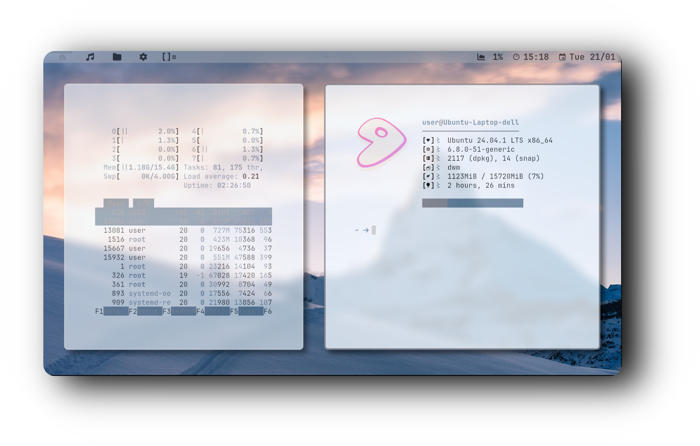
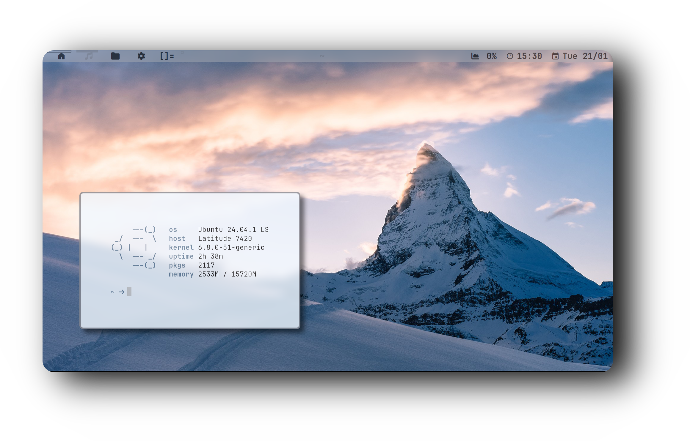

<div align="center">

```css
   ___    ____    ______  ____  ____  __     ____  ____
  / _ \  / __ \  /_  __/ / __/ /  _/ / /    / __/ / __/
 / // / / /_/ /   / /   / _/  _/ /  / /__  / _/  _\ \  
/____/  \____/   /_/   /_/   /___/ /____/ /___/ /___/  
                                                       
```


<h1>
      
</div>
</div> 
  
## ⚙️ Features
- **Window Manager** :bento: [DWM](https://dwm.suckless.org/)
- **Application Launcher** :rocket: [Dmenu](https://tools.suckless.org/dmenu/)
- **Terminal Emulator** :leaves: [ST](https://st.suckless.org/)
- **Shell** :shell: [Fish](https://fishshell.com/)
- **Compositor** :shaved_ice: [Picom](https://github.com/yshui/picom)

### :octocat: ‎ <sup><sub><samp>HI THERE! THANKS FOR DROPPING BY!</samp></sub></sup>


<div style="display: flex; align-items: center; margin-bottom: 40px;">
  <div style="flex: 1; padding-right: 20px;">
    <p><strong>🚀 Resource Efficiency</strong></p>
    <p>Optimized for performance and minimal resource usage. On average, my setup consumes between <strong>250 MB and 400 MB of RAM</strong>, depending on the installed packages and background services. This lightweight configuration maximizes system resources for essential tasks and keeps everything running smoothly.</p>
<h1>
      
</div>
</div> 


## 🔑 Key Bindings

#### 📱 **Applications**

- **$mod+q** – KILL  
- **$mod+Return** – ST
- **$mod+f** – FIREFOX  
- **$mod+d** – DMENU  
- **$mod+e** – PCMANFM

<div align="center">

## Installation

<div align="center">
```
curl -fsSL https://raw.githubusercontent.com/user7210unix/White-DWM/main/install.sh | bash
```
